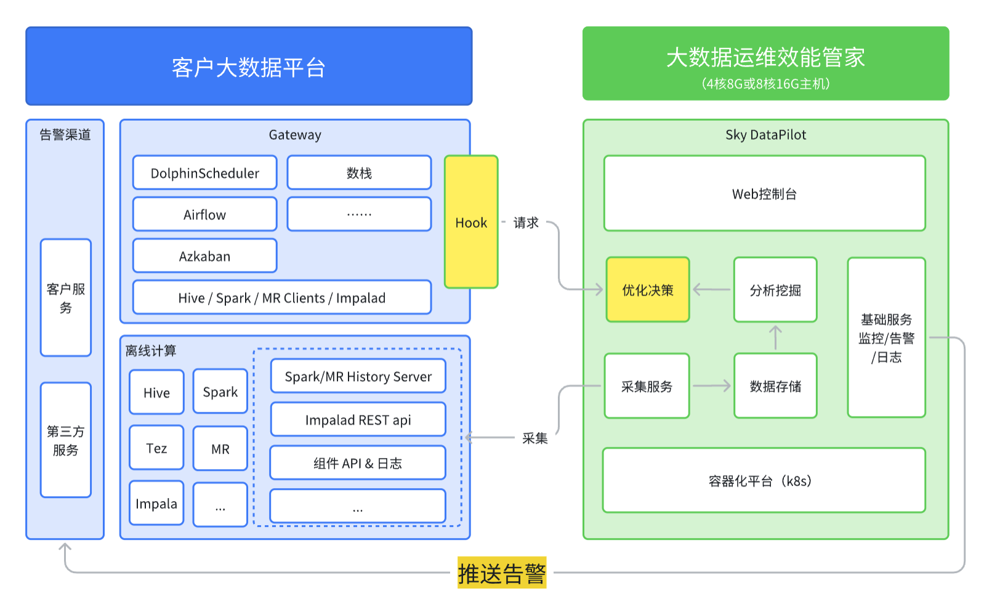

# 项目简介

> sky datapilot 是一站式大数据集群和任务的监控、告警、诊断、运维以及自动化优化任务平台，全面兼容CDH、HDP、华为云mrs等主流大数据平台，适配主流大数据任务引擎（MapReduce、spark、tez、impala）。实现大数据集群和任务的可视化监控、诊断建议、任务自动优化等，从而提高大数据集群运维效率、提升集群和任务稳定性。

​	注：上图黄色背景模块对应**大数据任务自动优化和告警推送**功能，属于商业付费版本功能。

# 主要功能

> - 大数据任务和集群信息采集，该部分数据不仅可用于sky datapilot内部分析使用，客户还可以根据采集数据模型进行自定义分析。
> - 大数据任务分析诊断
> - 大数据任务优化预估
> - 大数据任务监控告警
> - hdfs集群小文件治理，hive表冷热数据扫描。
