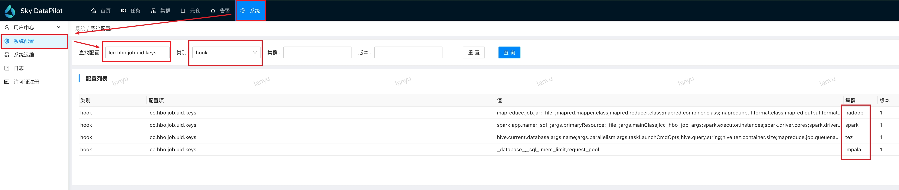

# 数据采集

​	数据采集作为整个服务的数据起点，合理配置采集任务是后续监控、分析、运维的关键，建议按照配置引导逐步配置采集任务，下面介绍采集核心配置参数。

| 配置项                          | 默认值                                                       | 说明                                                         | 备注                                                         |
| ------------------------------- | ------------------------------------------------------------ | ------------------------------------------------------------ | ------------------------------------------------------------ |
| collector.tasks                 | - cluster.name: "default"   enable.collect.yarn.app: true   spark.history: "http://127.0.0.1:28085#2.4.0;http://127.0.0.1:28081#1.6.1"   mr.history: "http://127.0.0.1:19888"   yarn.app.list.primary: "http://127.0.0.1:8088/ws/v1/cluster/apps"   yarn.app.list.backup: "http://127.0.0.1:8089/ws/v1/cluster/apps" | 该配置项是数据采集的核心配置，格式为数组（支持采集多个集群的数据），每个数组对象为一个采集集群，每个采集集群配置详细配置 cluster.name：采集集群名称 enable.collect.yarn.app：是否从yarn resource manager采集yarn app信息（该配置默认为true，不建议关闭） spark.history：spark history server地址 mr.history：MapReduce job history地址 yarn.app.list.primary：yarn resource manager主节点采集地址  yarn.app.list.backup：yarn resource manager从节点采集地址 yarn.app.list.backup.list：适配有多个从节点resource manager的场景，多个节点地址使用英文逗号分隔 hadoop.provider：适配华为云mrs采集队列信息的配置，如果使用的是华为云mrs，又需要分析队列信息，可以在该配置项填写：HuaweiMRS | 由于spark history server不同版本api返回值有差异，我们支持了多个spark history server版本的采集，需要在history server地址后使用#{VERSION}说明版本，当前支持的版本有： 1.6.0/1.6.1/2.1.0/2.2.0/2.3.2/2.4.0/2.4.8/3.1.2/3.2.1   如果版本不在上述列表，取向下最近版本即可，例如spark history的版本是2.4.5,填写为2.4.0即可。 如果不需要某种引擎任务的采集可以使用默认配置，或者删除默认配置，但是如果开启了该引擎类型任务采集则必须正确填写该引擎history地址配置信息。 |
| enable.collect.spark            | true                                                         | 是否开启spark任务的采集                                      |                                                              |
| enable.collect.mr               | true                                                         | 是否开启mr任务的采集                                         |                                                              |
| enable.collect.yarn.running.app | false                                                        | 是否开启运行时yarn app的采集                                 |                                                              |
| enable.collect.impala.collector | false                                                        | 是否开启impala任务的采集                                     |                                                              |
| enable.kerberos.check           | false                                                        | 被采集的系统是否开启了kerberos验证                           |                                                              |
| principal                       |                                                              | 填写当前已有的principle，格式：HTTP@xx.COM.CN                |                                                              |
| keytab                          |                                                              | 在服务端部署机器执行，keytab文件地址需要替换对应位置  xxd -ps -c0 /etc/security/keytabs/spnego.headless.keytab \| tr -d '\n' 执行完成将输出内容复制到该字段 |                                                              |
| kdc.conf                        |                                                              | 将krb5.conf文件内容复制，确认以下配置，没有则添加 dns_lookup_realm false dns_lookup_kdc true 将修改后内容复制到该字段 |                                                              |

# 首页

​	首页展示的是集群任务的完成和资源使用概览，以及告警相关的摘要和趋势。

## 概览

> - 预计收益率：展示最近7天全部任务的内存预计收益率（收益率=(原始内存使用量-预估优化后内存使用量)/原始内存使用量*100%）以及各个引擎在整个收益中的占比。
> - 任务异常数：近7天任务执行经过sky datapilot诊断后有异常，可优化的任务数的变化曲线，具体异常信息可以查看任务执行列表。
> - 任务告警量：近7天任务告警数量。

## 任务相关

> 1. 小时完成数：展示今天、昨天和过去一周平均的从零点到当前所在小时之间每个小时完成的任务数分布和趋势，x轴代表时间整点，y轴表示截止到x轴整点对应的前一个小时内所有完成的任务数。
> 2. 累计完成数：展示今天、昨天和过去一周平均的从零点到当前所在小时之间每个小时累计完成的任务总数分布和趋势，x轴代表时间整点，y轴表示截止到前x个小时内所有完成的任务总数。
> 3. 队列排队情况：展示今天、昨天和过去一周平均的各个队列的任务排队情况，x轴表示时间，y轴表示在当前时间队列的排队任务数。
> 4. 引擎资源内存占比分布：展示各类引擎（目前支持mr、tez、spark）近七天每天使用的内存资源占当天总的内存资源使用量的比。

## 告警相关

> 1. 告警列表：展示告警组中业务组的最近10条告警。
> 2. 业务组告警分布趋势：展示告警组中业务组的各个告警规则的告警趋势，x轴代表日期，y轴代表对应日期该组下各个告警规则的告警数量。
> 3. 告警组统计：展示各个告警组的总的告警数量趋势，x轴代表日期，y轴代表对应对应日期各个告警业务组的总的告警数量。

# 任务

## 执行列表

​	执行列表支持展示5种引擎（MapReduce、spark、tez、impala、flink）任务的历史执行信息。可以根据app id、tez dag id、impala query id、job id、app name、队列、任务开始时间等过滤查询到对应引擎任务的执行记录，每条执行记录包含一些作业运行的摘要信息：

> 1. Yarn Application ID：对应yarn上的application id，点击该id可以跳转到本次任务执行的优化分析页面。
> 2. 任务id：同一个任务多次提交执行会被归一同一个任务，该id就是该任务的唯一识别号，点击该id可以跳转到该任务的详情页面。
> 3. 作业开始、结束时间
> 4. 诊断标签：经过诊断分析发现的异常问题的标签。
> 5. 是否优化：本次作业执行是否进行参数优化（注：自动优化为商业付费版本功能，社区版本该字段值均为未优化）。
> 6. 作业执行队列
> 7. 等待以及运行时长
> 9. CPU、内存、io使用量指标
> 10. 任务最终状态

## 任务列表

​	任务列表可以根据任务类型、任务id、该任务最近一次执行的作业时间范围进行过滤查询任务。点击任务id可以进入任务详情页面，页面包含了该任务历史执行的作业的信息，包括任务摘要信息和作业执行明细信息。

​	任务摘要包含：

> - 任务类型
> - 任务内容
> - 最近30天执行次数
> - 平均运行时长

​	作业执行明细包含：

> - 作业执行时长变化趋势图
> - 作业等待时长变化趋势图
> - 作业CPU使用量变化趋势图
> - 作业内存使用量变化趋势图
> - 作业执行列表

## impala

### impala query
展示impala 查询结果，包含了当前的查询是否有进行统计分析，
> - 执行数与时长统计
>> - 总执行数：SQL总执行个数
>> - 统计信息有缺失的执行数:时段内如果有统计信息缺失的表的SQL个数
>> - 总执行时长：时段内SQL的总执行时长
> - Query 执行列表
>> - 基本信息:query_id,type,SQL语句,开始时间,结束时间,运行时长,查询结果集等信息
>> - 统计信息:本次查询供共查询了几张表,缺失统计信息的几张表,存在统计信息的几张表,内存/CPU/IO读写情况等数据。
>> - 总执行时长
### impala资源池
展示impala资源池的统计信息，及不同资源池的分池数据统计。
当前资源池的TotalMemory/PendingMemory/UsedMemory等数据及任务超超时拒绝等情况。
## 优化分析

### 优化收益预估

​	展示各个队列各个引擎分类的天粒度下内存使用量和收益预估值，以及该引擎和队列下收益预估top 100的任务。

### 任务优化分析

​	对具体任务执行进行诊断（不同引擎诊断维度有差异），发现任务异常，具体包含：

> 1. 任务基本信息
> 2. 任务阶段统计信息
> 3. 任务运行时长分析
> 4. gc频率分析
> 5. 资源使用分析

## 优化设置

### 任务指纹

​	任务指纹管理的是如何计算生成任务id的一段lua脚本代码，产品初始了一个比较通用的计算任务id的代码版本，可以查看、编辑任务指纹，在编辑指纹时可以在页面进行调试，看是否与期望值匹配。

​	任务指纹定义的是任务id如何计算的过程，与之紧密配合的是系统配置中hook配置项：lcc.hbo.job.uid.keys 的配置，该配置集群字段对应有hadoop、spark、tez、impala四种引擎，该配置定义的是任务id指纹计算的入参，后台服务会根据入参定义尝试从作业运行的信息中获取到这些信息，将这些数据和引擎类型作为入参调用任务指纹脚本，从而产生一个全局唯一的任务id。

​	如果系统内置的lcc.hbo.job.uid.keys和指纹脚本不满足需求（比如：多个逻辑上认为是不同任务的作业归一到了同一个任务，或者逻辑上认为是同一个任务的作业归一到了不同的任务），可以调整lcc.hbo.job.uid.keys或者指纹脚本以满足归一准确的需求。当编辑完任务指纹后，新的计算逻辑便会生效，如果变更后的计算逻辑影响到了之前的任务id计算逻辑，那么这些任务就产生新的id，旧的任务id会被弃用。

# 集群

## 队列分析

​	显示接入系统yarn集群的CPU/内存资源的数据变动情况,用于排查当前集群资源CPU/内存资源是否到达瓶颈,根据不同的队列资源情况观察是否因某个或某些队列的资源设置不合理导致性能利用不合理。
> - 所有队列：显示不同时间点的yarn集群的TotalCPU/PendingCPU/xxx队列UsedCPU/TotalMemory/PendingMemory/xxx队列UsedMemory,可用来观察集群整体的pending情况及是否存在CPUPending但Memory空闲,MemoryPending但CPU空闲的情况。
> - 指定队列：yarn集群中不同队列的信息展示，包括当前队列的maxCPU,maxMem,minCPU,minMem,pendingCPU,pendingMem,totalCPU,totalMem,usedCPU,usedMem等指标.主要用来观察当前队列是否存在因MaxMem/MaxCPU导致的pending 情况。
> - 队列信息：显示当前yarn集群的基本配置信息，如队列类型,SchedulingPolicy,Preemptable等信息。

## 小文件治理
显示当前接入的集群中hive表数据的小文件情况,包括小文件扫描和小文件合并两个功能，功能相互独立,可仅开启小文件扫描，观察小文件的情况是否很严重，再看不同的表情况再决定合并哪些表。
> - 开通小文件治理
未开通会有开通提示，请点击产品页面里的配置引导-管控配置将ops_table_scan_enable/ops_merge_file_enable开启，请注意开通后并不会立即可用，需要在客户端安装agent方可使用,agent安装参考安装部署里面的 小文件/冷热数据治理agent部署 部分。 
> - 产品功能
>>  - 概览
当前集群的hive表的统计信息，参见指标释义。
>>  - Hive表小文件治理
展示当前扫描出的hive表数据,库名/表名/表存储量/文件数/文件平均大小/分区数/小文件分区数等数据用来辅助决策哪些表需要加入治理，默认按照文件平均大小排序.操作有加入治理/移除治理/治理历史。在进行小文件合并前需要配置小文件合并策略,其中执行队列为yarn对立的名称,默认不治理7天内的使用数据,可按需修改,对非分区表不起作用。hive 治理的用户最好设置为hive 最高权限的用户防止出现低权限用户合并不成功的问题。对于delta/hudi/iceberg及hive 事务表暂不支持自动合并，扫描出此类表需要用户自己手动合并。
>>  - 治理任务历史
展示对某些表的治理任务历史，可以观察是否处理成功，合并前后的数据
> - 指标释义
>  
| 指标                     | 含义                                                                            |
|--------------------------|---------------------------------------------------------------------------------|
| 表存储量                 | 一张表实际占用HDFS的文件大小的总量,分区表为全部分区相加，非分区表为全部文件相加 |
| 是否分区表               | 表是否为分区表                                                                  |
| 分区数                   | 如果表为分区表，计算当前表的分区总数                                            |
| 小文件分区数             | 表为分区表时: 计算分区内平均文件大小是否小于64M(可调)的分区总数                 |
| 小文件分区占比           | 表为分区表时: 小文件分区数占比总分区数的百分比                                  |
| 文件数                   | 计算表涉及到的文件总数                                                          |
| 平均文件大小             | 计算表的表存储量/文件数的比值                                                   |
| 存储总量                 | 所有表的表存储量即全部的表实际占用HDFS的文件大小总量                            |
| 文件总数                 | 所有表的文件数的总和,包含了分区表及非分区表实际上在HDFS存储的文件个数           |
| 平均文件大小             | 所有表的表存储总量/文件总数的平均值                                             |
| 表总数                   | 所有表的总数                                                                    |
| 分区表总数               | 分区表的情况下，所有分区表的表总数                                              |
| 分区表总分区数           | 分区表的情况下，所有分区表的分区总数                                            |
| 非分表表总数             | 非分区表的情况下，所有表的表总数                                                |
| 小文件表存储总量         | 小文件即平均文件大小小于64M(可调)的表的存储量累计值                             |
| 小文件表的文件总数       | 小文件即平均文件大小小于64M(可调)的表的存文件数累计值                           |
| 小文件表平均文件大小     | 小文件即平均文件大小小于64M(可调)的表的存储总量/文件总数                        |
| 小文件表的表总数         | 小文件即平均文件大小小于64M(可调)的表总数                                       |
| 小文件表的分区表总数     | 小文件即平均文件大小小于64M(可调)的分区表总数                                   |
| 小文件表的分区表总分区数 | 小文件即平均文件大小小于64M(可调)的分区总数                                     |
| 小文件表的非分区表总数   | 小文件即平均文件大小小于64M(可调)的非分区表总数                                 |
> - 资源控制
>> - mysql查询的资源控制
>>> - 扫描的hivemetastore的DBLS，TBLS，PARTITIONS 表的字段都有索引
>>> - 默认对分区为10000及以上的分区个数不进行扫描，可按照需求调整
>>> - 取分区数据按照批次获取，每次获取100条，可按照需求更改大小，分区数过多也不用担心
>>> - 扫描并发默认2，可按需调整
>> - 合并时yarn资源的控制
>>> - 合并过程中需要用到yarn资源，需要配置一个可以运行任务的队列和用户
>>> - 合并时对于最少7天内分区的访问创建不进行处理，保障最常用的数据不受影响
>>> - 支持并发提交合并任务，默认值为1即串行提交，可根据自己资源情况自行更改
>>> - 支持单任务合并多分区，默认50个分区提一个hive任务，可按照具体资源情况调整
## hive表冷热数据
集群在运行一段时间后，时常会产生一些临时表/无查询/查询极少的表占用集群容量空间，导致存储赠本增加，造成了存储的资源浪费，一些较大的表/不常使用的表在分布式数据计算中占用了较高或额外的网络传输影响到了任务的计算速度,当前功能为发现哪些表数据冷/温/热数据。展示当前的表冷热数据统计信息。
> - 开通冷热数据表扫描
>> - 部署agent并通过配置引导选择管控配置ops_storage_ls_log_file_enable(是否开启冷热数据扫描
) 开启
> - Hive冷热数据表容量分布
>> - 展示目前集群的HDFS容量趋势(总容量及冷热数据容量),热/温/冷/极冷数据的占比
> - 数据表冷热明细
>> -  不同的库/表具体的冷热数据情况/大小/分区/路径/最近一次访问时间等数据展示
# 元仓

## 大数据元仓

​	展示clickhouse库中大数据相关任务、集群的存储模型，包括：spark、hadoop、tez、impala以及yarn集群。用户可通过jdbc连接查询。

## 报表统计

### 集群分析

​	集群维度的监控分析，包含集群基本信息以及运行时机器负载和yarn资源的监控信息

### 任务分析

> - 任务分布：任务在不同维度的分布情况
> - 优化信息：任务优化相关（任务开启自动优化前后对比）
> - 异常信息：任务异常的统计信息，以及异常原因分布
> - 数据量排行：app和tez dag维度任务输入输出以及shuffle数据量大小排行
> - 资源使用量排行：app和tez dag维度任务时长、内存使用、cpu使用排行

# 告警

​	告警模块为系统本身和大数据集群以及任务提供监控告警功能

## 活跃告警

​	显示当前正在活跃的告警，当告警恢复后，会将当前活跃告警移除，支持通过告警规则和告警首次触发时间过滤活跃告警

## 历史告警

​	显示历史活跃以及已经恢复的全部告警，同样支持通过告警规则和告警首次触发时间过滤。查看告警详情可以看到该告警的相关细节信息，包括告警规则名称、所属业务组、规则备注、数据来源、告警级别、事件状态、标签、触发时间、触发时表达式的值、promql、执行频率和时长、告警通知渠道、通知组等相关信息。

## 告警规则

​	告警规则页面可以创建新告警、批量导入导出告警、批量删除告警以及批量启停告警。其中我们出厂内置了一些常见告警，客户可以根据需要创建告警。

### 新建告警

​	制定告警规则是针对监控指标灵活地根据不同业务场景配置不同告警的过程。

> - 数据源：默认使用产品自带的Prometheus，客户可以新建数据源，使用自定义数据源
> - 告警业务组：我们根据不同的监控场景内置了三个告警业务组，分别是：
>   - 系统组：监控sky datapilot产品服务本身相关异常指标，包括api请求异常数、job history请求失败数等相关系统核心告警
>   - 节点组：监控sky datapilot产品部署服务器相关异常指标，当服务器出现异常时，可以及时将服务器异常事件告警出来
>   - 业务组：监控客户大数据任务相关异常指标，比如：任务失败、数据倾斜等
> - 规则配置：告警能够触发的具体配置，包含：
>   - 连续满足多少次表达式
>   - 查询频率
>   - 告警阈值表达式
>   - 告警级别
>   - 重复通知频率
>   - 告警最大发送次数
>   - 告警恢复是否需要通知
>   - 观留时长
> - 告警通知：支持配置多个告警渠道（邮件、短信、飞书机器人等），多个告警通知组。

## 时序查询

​	时序查询提供了查询Prometheus数据的入口，在排查问题时可以查询指标趋势辅助定位问题。

## 系统管理

​	系统管理负责维护管理告警相关配置

> - 告警业务组：告警业务组指的是在新建告警规则时，定义该告警属于哪一个告警业务组，对告警规则进行基础的分类。
> - 告警成员：需要将告警通知到的人员，通知渠道支持短信告警、邮箱通知、飞书、钉钉、企业微信机器人通知。
> - 告警通知组：告警通知组包含至少一个告警成员，新建告警规则时，至少需要绑定一个告警通知组，在组内的全部告警成员都能收到告警消息推送。
> - 数据源管理：告警监控的指标数据源，默认是sky datapilot产品自带的Prometheus服务。
> - 消息通知：配置短信、邮箱、webhook告警通知的相关基础配置，例如邮箱服务器配置、短信告警服务商配置、短信告警模板配置等。

# 系统

## 用户中心

### 用户管理

​	用户管理支持创建、删除用户以及更改用户角色，不同角色拥有不同权限。

> - 系统管理员：
>   - 用户管理：拥有新增、删除管理员和普通用户权限，以及修改管理员和普通用户角色权限。
>   - 其他：拥有服务配置查看和修改权限以及容器终端登入权限
> - 管理员：
>   - 用户管理：无任何新增、删除、管理用户角色的权限。
>   - 其他：拥有服务配置查看和修改权限以及容器终端登入权限
> - 普通用户：无任何新增、删除、管理用户角色的权限。
>   - 用户管理：无任何新增、删除、管理用户角色的权限。
>   - 其他：仅拥有服务配置查看权限，无容器终端登入权限

### 个人中心

​	个人中心页面支持修改密码和用户名

## 系统配置

​	系统配置核心目的是为sky datapilot产品的服务提供统一配置管理的中心，支持查找、更新、新增，按照服务可分为以下几类：

1. api：后端服务的相关，大部分属于高级配置，用户可以不关心。
2. collect-server：数据采集服务相关，包含MapReduce、tez、spark、impala相关任务的采集配置，具体可看数据采集章节。
3. hook：任务归一相关，与任务>优化设置>任务指纹配合共同生成同一任务的唯一uid，常规情况下这些keys不需要变更，如有需要可在交流群中反馈，由技术同学提供支持。

## 系统运维

​	系统运维为sky datapilot产品的服务提供了基础的服务容器状态监控和终端切入功能，方便在特殊场景下运维人员能够能登入容器进行问题排查

## 系统日志

​	系统日志模块能够让用户在页面查看sky datapilot产品全部服务的日志，辅助问题排查
